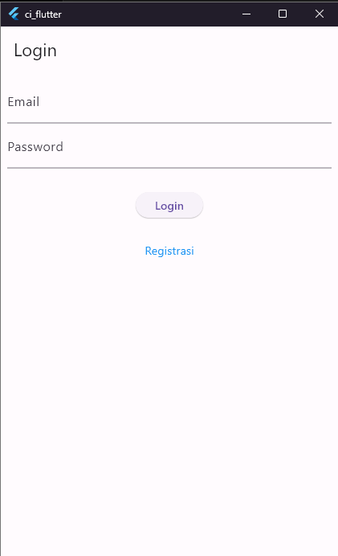

<p align="center">
  <a href="" rel="noopener">
 </a>
</p>

<h3 align="center">Aplikasi Simple Toko</h3>

<!-- <div align="center">

  []() 
  [](https://github.com/kylelobo/The-Documentation-Compendium/issues)
  [](https://github.com/kylelobo/The-Documentation-Compendium/pulls)
  [](/LICENSE)

</div> -->

---

<p align="center"> Aplikasi toko simpel yang menggunakan Flutter dan CI4
    <br> 
</p>

## 📝 Table of Contents
- [About](#about)
- [Getting Started](#getting_started)
- [Deployment](#deployment)
- [Usage](#usage)
- [Built Using](#built_using)
- ~~[TODO](../TODO.md)~~ ( Not Yet )
- ~~[Contributing](../CONTRIBUTING.md)~~
- [Authors](#authors)
- [Acknowledgments](#acknowledgement)

## 🧐 About <a name = "about"></a>
aplikasi ini merupakan hasil akhir dari tugas kuliah, yang nantinya akan digunakan untuk project selanjutnya sebagai acuan

## 🏁 Getting Started <a name = "getting_started"></a>
<!-- . See [deployment](#deployment) for notes on how to deploy the project on a live system. -->

### Prerequisites

#### Flutter Stuff
  - [Flutter SDK](https://docs.flutter.dev/get-started/install)
  - [Android toolchain - develop for Android devices (Android SDK version 34.0.0)](https://developer.android.com/studio)
  - Web Browser

  ##### Jika ingin menggunakan emulator windows maka install :
  - Visual Studio - develop Windows apps (Visual Studio Community 2022 17.10.2)
    - Desktop Development with C++ ( MSVC v143, JIT Debbuger, C++ CMake, Windows 10 SDK)

  ##### Code Editor
  - [VS Code](https://code.visualstudio.com/)
  - [Android Studio](https://developer.android.com/studio)
    ###### Install komponen ini:
    - android SDK Platform, API 34.0.5
    - Android SDK Command-line Tools
    - Android SDK Build-Tools
    - Android SDK Platform-Tools
    - Android Emulator

ketik ini untuk mengecek status flutter 

```
flutter doctor -v 
```

setelah itu masuk ke project dan jalankan.
```
dart pub get
```
pastikan ada pubspec.yaml didalamnya

#### Code Igniter 4
 - [Composer](https://getcomposer.org/doc/00-intro.md#installation-linux-unix-macos)
 - intl plugin untuk php | [Help Guide](https://stackoverflow.com/questions/60250533/codeigniter-4-problem-installing-with-composer)

setelah itu masuk ke project directory, pastikan ada composer.json didalamnya
setelah itu jalankan
```
composer require
```

#### Database
  - MySQL (gunakan xampp saja)
  jangan lupa membuat tabelnya di phpmyadmin 
  
  File Query : [sql file](./SQL%20Table%20Create.txt)


### Setup Development
A step by step series of examples that tell you how to get a development env running.

Say what the step will be

#### Flutter Setup

Mengubah File api_url.dart di lib/helpers/ :
ubah base_url dengan url yang dikeluarkan oleh API CI4

```
static const String baseUrl = 'http://your_link';
```

setelah itu jalankan
```
flutter run
```

nanti akan ada tampilan seperti

<p align="center">
  <a href="" rel="noopener">
 </a>
</p>

<!-- ## 🔧 Running the tests <a name = "tests"></a>
Explain how to run the automated tests for this system.

### Break down into end to end tests
Explain what these tests test and why

```
Give an example
```

### And coding style tests
Explain what these tests test and why

```
Give an example
``` -->

## 🎈 Usage <a name="usage"></a>

### Flutter Docs

Dokumentasi aplikasi ini
```
dart pub global run dhttpd --path doc/api --port=9000
```

### API Docs

Coming soon

## 🚀 Deployment <a name = "deployment"></a>
Coming Soon

## ⛏️ Built Using <a name = "built_using"></a>
- [MySQL](https://www.mysql.com/) - Database
- [Flutter](https://flutter.dev/) - App Framework
- [Code Igniter 4](https://codeigniter.com) - API Server 

## ✍️ Authors <a name = "authors"></a>
- [@Ariq](https://github.com/AriqFaridzki) - Praktek dan Dokumentasi
- [@Sabam Parjuangan](https://www.linkedin.com/in/sabam-parjuangan-b2769949/?originalSubdomain=id) - Dosen yang telah membantu dan memberikan kode awal

<!-- See also the list of [contributors](https://github.com/kylelobo/The-Documentation-Compendium/contributors) who participated in this project. -->

## 🎉 Acknowledgements <a name = "acknowledgement"></a>
Terima kasih yang sudah membantu saya mendapatkan ide walapun tidak sengaja atau sengaja :D

- [@Dicky](#) - CORS Specialist
- [@Zaidan](#) - CORS Specialist 2nd
- [@Evraldi](#) - Kapten 
- [@Kuldii Project](https://www.youtube.com/watch?v=epRWFH47xCI&list=PL7jdfftn7HKsfTtv8FOaTbLIf7feiQTRu) - Tutorial flutter playlist
- [Dart](https://dart.dev/guides) - Dokumentasi Dart

dan teman teman ku semuanya :D